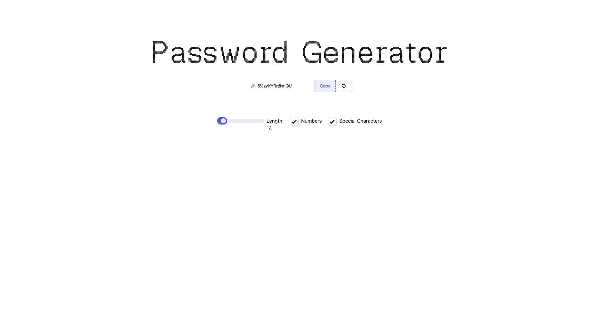

# Password Generator

A simple, fast password generator built with React + Vite, styled with Tailwind CSS v4 and DaisyUI.
This project was made for implementation of several react hooks (e.g. useState, useEffect, useCallback and useRef);



## Features

- Generate random passwords instantly
- Length slider (8–100)
- Toggle options for:
    - Numbers (0–9)
    - Special characters (e.g. `!@#$%^&*()_+-=[]{}|;:,.<>?`)
- Copy-to-clipboard button
- Regenerate button

## Tech Stack

- React
- Vite
- Tailwind CSS v4 (via `@tailwindcss/vite`)
- DaisyUI
- ESLint

## Getting Started

### Prerequisites

- Node.js (recommended: latest LTS)

### Install

```bash
npm install
```

### Run locally

```bash
npm run dev
```

Then open the URL shown in your terminal (usually `http://localhost:5173`).

## Scripts

- `npm run dev` — start the dev server
- `npm run build` — build for production
- `npm run preview` — preview the production build locally
- `npm run lint` — run ESLint

## Notes

- Clipboard copy uses `navigator.clipboard`. This works on `https://` origins or `http://localhost`.
- Theme/fonts are configured via Tailwind v4 + DaisyUI in [src/App.css](src/App.css).

## Project Structure (high level)

- [index.html](index.html) — app entry HTML
- [src/main.jsx](src/main.jsx) — React bootstrap
- [src/App.jsx](src/App.jsx) — password generator UI + logic
- [src/App.css](src/App.css) — Tailwind/DaisyUI + font definitions
